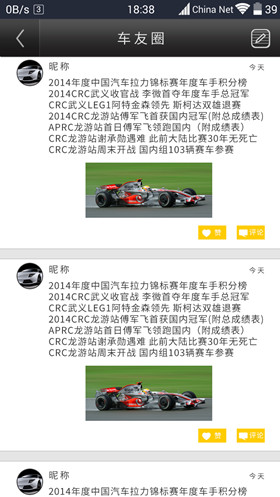

#“开赛啦”赛事管理平台介绍   

　　一个赛事组织者可在线发布/推广赛事，用户可在线查看赛事信息，比赛成绩及报名的赛事运维系统，包含PC端，android端和服务器端；该系统可分为三类身份：1、平台管理者，2、赛事组织者，3、移动端用户（包括普通观众，参赛选手和赛场工作人员）。现对他们进行分别介绍；   

## 平台使用者介绍   

###平台管理者   
平台管理者最主要的职责有3个，分别如下所示：   

*	审核注册赛事组织者的身份   
赛事组织者若想在本平台发布赛事，首先要在平台上注册，并上传相应证件，公平台管理者审核，审核通过后的赛事组织者才能够在本平台发布赛事；   
*	审核赛事信息的合法性    
审核通过后的赛事组织者发布赛事不能立刻显示到客户端，需要平台管理者再次审核赛事的合法性，通过后用户即可在手机客户端上浏览，查看；   
*	审核用户评论，动态信息的合法性；   
所有的移动端注册用户都可以发布赛事评论和朋友圈动态，平台管理者有义务清楚一些不合法的内容，并能冻结恶意用户的账号；   

###赛事组织者   
赛事组织者身份只能在PC端注册，并需要平台管理者审核；发布赛事也只能在PC端进行。赛事组织者的主要功能有：   

*	在线发布赛事，推广赛事；   
*   向系统申请工作人员账号；      

###移动端用户   
移动端用户大体可分为两类：1、注册用户，2、非注册用户；其中注册用户又可以分为普通观众和认证运动员。普通观众和认证运动员的身份区分不是在注册时确定，而是在注册后自行认证的，也就是说，刚注册时都是普通观众，但在登录后可以将自己认证为比赛选手。   

*	注册用户   
注册用户分为普通观众和认证运动员，其中认证运动员是以普通观众登录后自愿提交认证信息给服务器进行认证的；**由于开发初期，无法获得运动员相关认证数据库，所以采用人工认证**；   

*	非注册用户   

也就是工作人员账户，工作人员即在赛事现场进行入场检录，赛场维护和赛事成绩录入的人员；共有4种角色，由赛事组织者在赛事比赛之前，自行制定提交，其账号和密码都是由平台自动分配的特殊账号。   

## 赛事的运维   
　　本平台的主要功能就是进行发布赛事的运维，主要分为赛前，比赛时，赛后三个部分；   
### 赛前运维   
在这一阶段，认证为运动员的用户可以报名参加自己所喜欢的赛事，普通观众也可以付费报名参加自己喜欢的赛事，这一阶段主要是供用户报名；

### 比赛时运维   
比赛时，赛事组织者可以利用本平台进行现场赛事管理，包括运动员及观众的入场审核（报名成功后会返回二维码，扫描比对数据成功后即完成审核），赛程的安排通知，比赛成绩的录入等等，都可通过本平台发布或录入，用户可在移动端随时查看。以上工作都有赛事工作人员完成，其由赛事组织者指定，有系统专门分配的账号；   

### 赛后运维   

比赛完成后，所有参加过该赛事的移动端注册用户都可对赛事进行评论，发稿或投诉；赛事组织者可以在线查看并回复；此外，所有参加同一赛事的用户被自动加入到该赛事的朋友圈中，可在该朋友圈中发表动态并评论，该赛事朋友圈的管理权归赛事组织者所有，赛事组织者也可参与朋友圈的互动；当然，用户也可以屏蔽某个赛事朋友圈；   

## 移动端截图   
> 
> 
>    

> 
> 
>    

> 
> 
>    

## PC端截图   

> 
   
>    

>    
  
>    

> 

